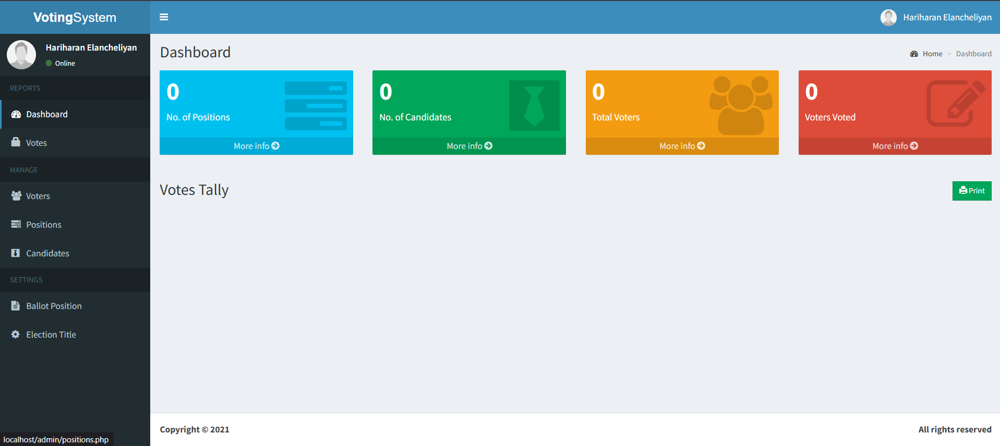

# Online Voting System Using PHP

Web-based voting system built with PHP and MySQL.

## Requirements

- XAMPP (Apache + MySQL + PHP)
- Web browser

## Project Structure

- `index.php` - voter login/start page
- `admin/` - admin panel pages
- `includes/` - shared frontend PHP includes
- `admin/includes/` - shared admin PHP includes
- `db/votesystem.sql` - database schema and seed data

## Setup Guide (XAMPP)

1. Install XAMPP.
2. Copy this project folder into your XAMPP `htdocs` directory.
	- Example path: `C:\xampp\htdocs\online-voting-system-using-PHP`
3. Start Apache and MySQL from the XAMPP Control Panel.
4. Open phpMyAdmin at `http://localhost/phpmyadmin`.
5. Create a new database named `votesystem`.
6. Import the SQL file:
	- Open the `votesystem` database
	- Go to Import
	- Select `db/votesystem.sql`
	- Click Go
7. Open the project in your browser:
	- `http://localhost/online-voting-system-using-PHP/`
8. Open the admin panel:
	- `http://localhost/online-voting-system-using-PHP/admin/`

### Admin Account

- Username: harie
- Password: dummy_password

## Troubleshooting

- If you see a database connection error, verify MySQL is running and `votesystem` exists.
- If pages do not load, verify the project folder name in `htdocs` matches your URL.
- If login fails, reset credentials directly in the database with a new `password_hash` value from PHP.

## Reference Images

- [Admin Images](https://docs.google.com/document/d/12ZJhS-xcs2cW5QB-VQUUJYhVluY4Pdy2KysCQ6w25fk/edit?usp=sharing) — contains screenshots of all admin panels

### Admin Page

